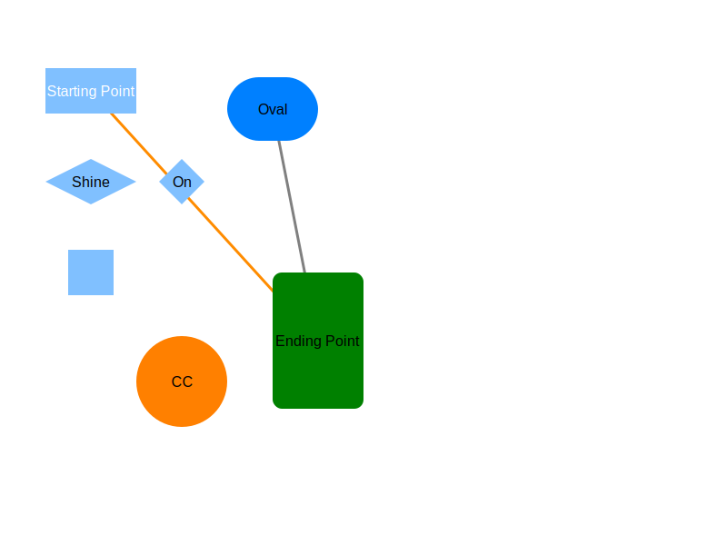

# Dialang: an ASCII Drawing Language

I want to be able to type in things like this:
```
diagram Example width 800 height 600 stylesheet css/default.css
color #80C0FF
rect A "Starting Point" center 100 100 size 100 50  url https://news.ycombinator.com  text-color white
rrect B "Ending Point" ul 300 300 size 100 150 color green class "unimportant trivial" text-class unimportant
oval C Oval center 300 120 size 100 70 color #0080FF
circle CC center 200 420 radius 50 color #FF8000 url https://www.duckduckgo.com class important
edge E from A.lr to B color darkorange
edge F from B to C class unimportant
rect Z " " center 100 300 size 50 50
diamond D "Shine" center 100 200  size 100 50 class c3
diamond D2 "On" center 200 200  size 50 50 class c4
```

...and get an SVG out:



So I traded a Sunday for that ability.  This is the result.

## Quick Start

From the root, run:
```
python diagram.py input-css.dgm > output-css.svg
```

Then open `output-css.svg` with a web browser, or Inkscape, or emacs.

Fiddle around with the file, re-run the program, and see what happens.

If you want to see it without the effects of the stylesheet, just delete
the part in `input-css.dgm` that says `stylesheet colorful.css`.

Note that you designate the start and end of edges by node ids, so the
edge follows the nodes wherever you move them.

## Syntax

Definitely something I will write up Real Soon Now.  But I think for a
project like this—meant for quick and easy use—if you need much documentation, it's failed.

If you find anything particularly confusing or frustrating, let me know.

### Basic Syntax

Everything is an Element or a Setting

Elements are:
- rect
- rrect (rounded rect)
- oval (not an ellipse)
- circle (technically an ellipse)
- diamond
- edge from one node (all the above are nodes) to another, by ID

`rect A "Starting Point" center 100 100 size 100 50`
means "draw a rectangle, with ID = A, and the label `Starting Point`,
that's 100 pixels wide, 50 pixels high, and centered at 100, 100".

You can also specify the upper-left corner (smallest x and smallest y)
of the rect instead of the center (see the next line of the example).

Settings are:
- diagram : this must be the very first non-comment line in the input; required fields are ID, width, and height
- color : set the color of everything except text (i.e. node shapes and edges) from here on; any color SVG accepts is fine: #F0F8FF, red, none (no quotes necessary)
- text-color : set the color of all text from here on

You can specify multiple top-level `color` and `text-color` settings; each
one takes effect on everything between it and the next time it's set.

You can express `width` and `height` of the diagram (but not any parts of it)
in `in`, `cm`, or `mm`, just like in SVG.  Default is pixels.

All other positions and sizes are in pixels.

The upper-left corner of the diagram is the origin: 0,0.  I apologize to
math teachers everywhere.

A comment line is any line whose first non-whitespace character is `#`.  The
`#` character is absolutely, positively, not in any way special outside that
context.  You cannot put a comment at the end of a line.

A blank line is any line with nothing, or only whitespace characters.
Blank lines and comment lines are ignored.

Outside quotes, multiple spaces are equivalent to one space, so if you
want to line things up nicely, you can. (Tabs?  What are tabs? I don't
know what you're talking about.  This is a Python project.)  Newlines
cannot be escaped. Weird line endings are fine.

### Special Features for Picky People

Everything color-related deals only with the `fill` color.  If you want
to change the `stroke` color, add a `class` to your node or edge, and
change it in the CSS.

If you want a label with a space in it, just enclose it in either
double quotes or single quotes; the outermost quotes will not be part
of the label.  Quotes cannot be escaped.

If you just want a shape with no visible label, label it with `" "`.

If you just want a label with no visible shape, try setting the associated
shape's color to `none`.  Beware that CSS stylesheets may override this.

Everything is drawn in order, except for edges, so later elements cover up
earlier elements.  All edges are drawn first, so they're under everything else.
You may want to include an `invisible` CSS class.

If you don't specify a CSS stylesheet, it will use `default.css` (in
the same directory as the SVG).

Someday, you will be able to specify where on a node you want an edge
to attach, instead of the default of the center; today is not that day.
The planned syntax for that, `myid.lr`, is currently ignored and treated
the same as just `myid`.

Every node has CSS class `node`, every edge has CSS class `edge`.
This is mandatory.  You can, however, add other classes with the
`class` and `text-class` attributes of edges and nodes. If you want to
add multiple classes, you *must* list them space-separated inside one
outer pair of quotes: `class "additionalclass otherclass"`.

### Arguments and Flags for the program

`python3 diagram.py [filename] [setting=value]*`

You can give it the name of an input file; if you give it `-` or omit
the filename, it will read from `stdin`. (That makes it easy to use as
part of shell pipelines.)

Specify the output file with `>`, as Dennis Ritchie intended.

You can give it a bunch of obscure default settings by specifying
key/value pairs.  The list will change over time, but right now it
includes:
```
color text_color edge_width diagram_width diagram_height
font_half_height font_average_width font_family css_href
```
Note that these use underscores `_` instead of dashes `-`; believe it
or not, this reduces the amount of confusion.  For me, anyway.

## Roadmap

I plan a few more features, including:
- arrows on the edges
- dashed arrows (possibly already achievable with CSS and `class`)
- ports (connection points) on the nodes
- `polygon` and `path` equivalents
- separate `node-color` and `edge-color` settings

Note that you can already do a lot of interesting things if you're one
of the couple dozen people who understand CSS: color changes on rollover,
animation on rollover, pretty much anything rollover-related.

You can rely on the above as much as you can rely on any software roadmap.

This is not intended to be a replacement for SVG, just a way for
humans to quickly write and read relatively simple diagrams.  It may
also be a useful intermediate format (because it's human-readable) for
programs that ultimately generate SVGs.

## Thoughts on the design:

This is mostly going to be free of semantics, operating at the shape level.

Objects will be able to refer to other objects' positions.  Initially,
this will just be so we can have edges going from node to node without
having to update positions in both places.

Later, maybe we will have a full constraint solver or something. If we
throw in routing of edges so they don't intersect (or minimze
intersection), then that's an interesting direction.

Might make sense to have a CSV output/input format.

Start with auto-placement?  or relative placement directions?

So sample:

color blue
rect A "Starting Point" center 100 100 size 100 50
rrect B "Ending Point" ul 300 300 size 100 150 color green
edge E from A lr to B

This should generate a blue rectangle from 50, 75 to 150,125,
a green rounded rectangle from 300, 300 to 400, 450,
and a blue edge going from 150, 125 to 350, 375 (occluded by the second rect)

Other shapes we can have:
circle
oval
ellipse
hexagon
parallelogram
left-leaning parallelogram
diamond
square?
up-trianlge
down-triangle
cylinder
90° rotations of the above

(Should we allow users to define their own shapes?
 Seems like a good future feature.)

(Or maybe let them define macros.)

I think we should have some defaults:
color: color to use for things if no overriding color specified (INOS)
edge-color: color to use for edges INOS
node-color: color to use for nodes INOS

OK, let's make that diagram above.

--04/07/24 12:44:54 EDT
