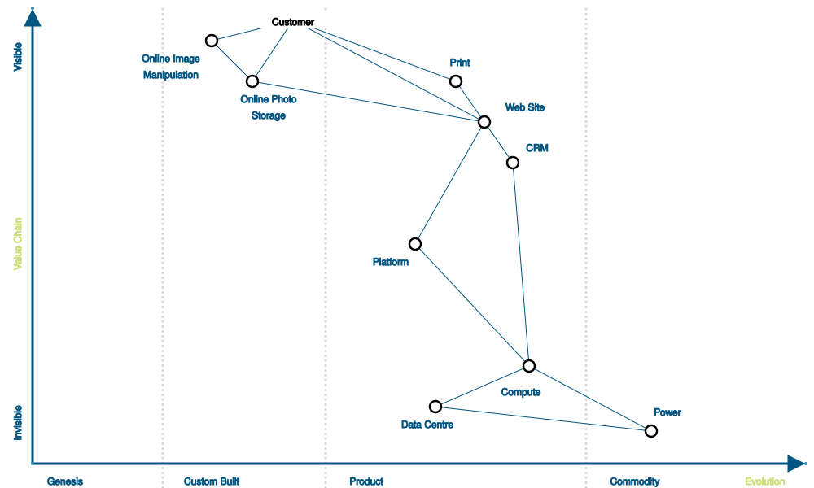

# Wardley Maps

I wanted to make sure dialang could draw decent-looking [Wardley Maps](https://www.wardleymaps.com/). (If you're unfamiliar with them, that site's a good intro.)

It can, with a couple small hacks.  The pudding:



(a recreation of the one here: https://miro.medium.com/v2/1*naVPldx9ZRvg9JcK6PT6PA.jpeg )

In order to create each circle with a label next to it, we split them up into two separate shapes, namely
a circle with no label, and a label with no shape (in wardley-1.dgm):

```
diagram "Wardley Map" width 1000 height 600 style clean
...
circle oim " " center 260 50  radius 7 class outline
rect loim1 "Online Image" class invisible text-class c3 size 100 30 center 210 70
...
edge e1 from customer to oim class thin
edge e3 from oim to ops class thin
```

The edges work fine, as expected.

I also needed a little trickery for the axes:
```
circle origin " " center 40 570 radius 2
circle evolution " " center 990 570 radius 2
circle value " " center 40 10 radius 2
...
edge x-axis from origin to evolution arrow head
edge y-axis from origin to value arrow head
```

The classes are available in the `clean` style, as well as in the `inverse` style used by `wardley-2.dgm` .
- `outline` uses a heavy stroke width
- `invisible` makes the node's shape invisible
- `thin` makes an edge thinner than normal
- `subtle` makes an edge gray and dashed (between the Evolution regions)

The whole input file is under 4 KB.

It should be very simple to read positions and labels in from an Excel
or CSV file, then generate a Wardley Map from them using dialang.

The `.dgm` files were created on 2024-05-27, though I didn't write
this documentation until 2025-01-19.
